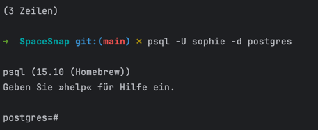
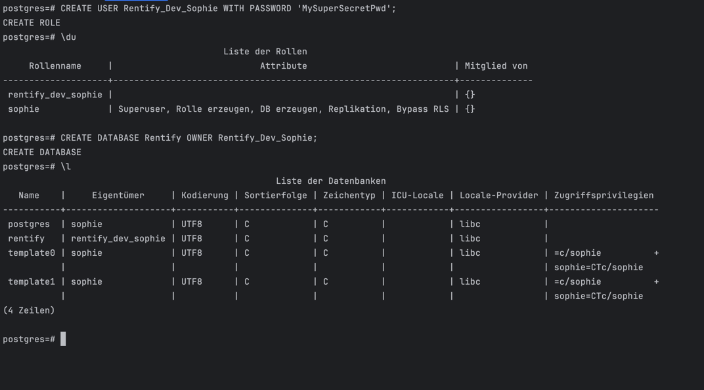

# PostgreSQL installation guide (MacOS)

###### 1. In case PostgreSQL  is not installed on your machine :
Run:
```bash
   brew install postgresql@15
```
###### 2. Integrate psql in zsh
Run the following command in order to be able to create a new Postgres Database with psql
```bash
echo 'export PATH="/opt/homebrew/opt/postgresql@15/bin:$PATH"' >> ~/.zshrc
source ~/.zshrc
```
###### 3. Start Postgre
Run:
```bash
brew services start postgresql@15
```
###### 4. Connect to PostgreSQL and Create a New Database
Before creating a database, check all available databases and their owners. This helps you identify the current setup and which role you should use to connect.
```bash
psql -l
```
Example Output:

| Name       | Owner | Encoding |
|------------|-------|----------|
| postgres   | R2-D2 | UTF8|
| template0  | Luke  | UTF8|
|  template1 | Lea   | UTF8|

Here, the owner is R2D2. Try connecting with this role
```bash
psql -U R2-D2 -d postgres
````
If this works, you are probably connected to PostgreSQL, and may connect you spring app to the Databse. You can skip 4.1.

Your terminal should look something like this:



--- 
###### 4.1 Try Connecting as the Default Superuser
By default, PostgreSQL creates a superuser role named postgres. Try connecting with it:
```bash
psql -U postgres
```
---

###### 5. Create an application specific database 

You now may create a new user to own the new db (for better security and access privilege). To create a new user, run the following SQL statement:
```SQL
postgres=# CREATE USER <YOUR_USERNAME> WITH PASSWORD '<YOUR_PASSWORD>';
```
Next, create a new database and specify the owner:
```SQL
postgres=# CREATE DATABASE <YOUR_DATABASE_NAME> OWNER <YOUR_USERNAME>;
```

Example:


## Connect Spring Boot To Postgres Database
In the src/main/resources folder, there should be an application.properties file.
The purpose of this file is to configure various properties, such as server port, database connection details, logging configuration, and more.

If add the following content to the application.properties file:

```properties
spring.datasource.url=jdbc:postgresql://localhost:5432/<YOUR_DATABASE_NAME>
spring.datasource.username=<YOUR_USERNAME>
spring.datasource.password=<YOUR_PASSWORD>
spring.jpa.hibernate.ddl-auto=<create | create-drop | update | validate | none>
spring.jpa.properties.hibernate.dialect=org.hibernate.dialect.PostgreSQLDial
```
The ddl-auto property sets the behavior of Hibernate’s schema generation tool and has five possible values:

create – On application start-up, drop all tables managed by Hibernate, then create them from scratch.
create-drop – On application start-up, create all tables managed by Hibernate. On shutdown, drop all of them.
update – On application start-up, update the existing tables to match the schema Hibernate expects if necessary.
validate – On application start-up, check that the existing tables match the schema Hibernate expects, and throw an exception if they do not match.
none – Do not perform any automatic schema management.


The correct value for spring.jpa.hibernate.ddl-auto depends on your specific use case. For this demo, you can use create-drop, which cleans up after itself when the Spring Boot application shuts down.

## Gemini
Step 1: Generate an API Key here: https://aistudio.google.com/apikey
Step 2: Replace <MY-SUPER-SECRET-KEY> with your generated API key
Step 3: Export the environment variable into your shell: run the following command to load the .env file and export its variables: 
```bash
export $(cat .env | xargs)
```
then you may start the app
```bash
 ./mvnw spring-boot:run
```

If you want to run the app via IntelliJ click the RentifyApp Dropdown > Edit config > Modify options > Select 'Environment variables' and add key value pair

